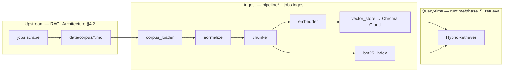
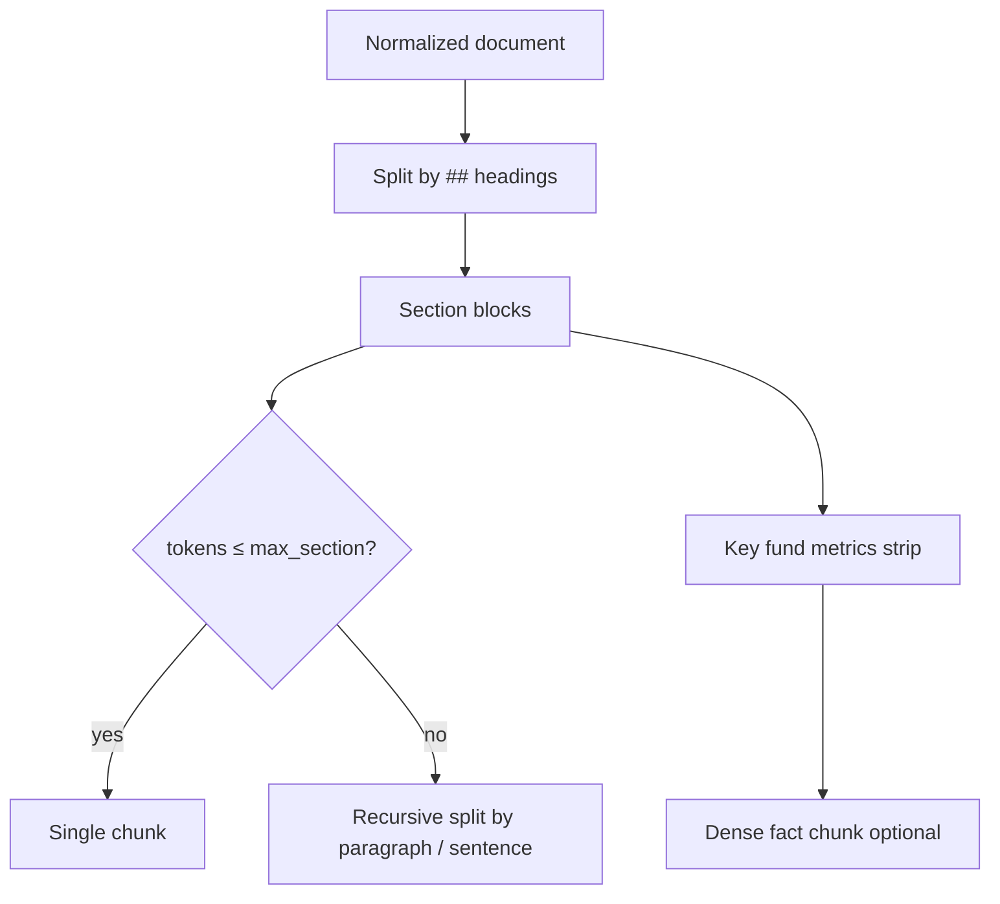
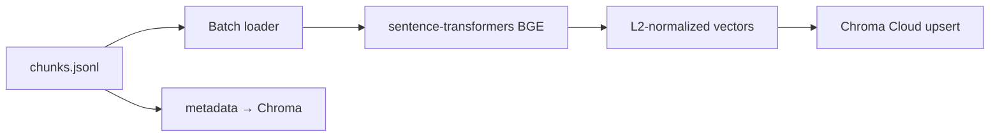
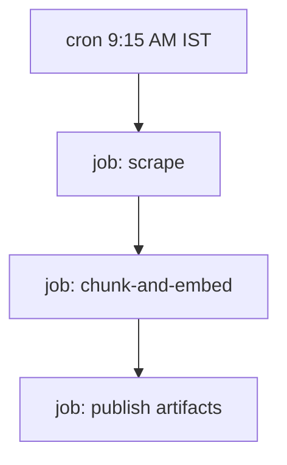

# Chunking & Embedding Architecture

## Document Purpose

This document specifies **how** scraped Groww scheme Markdown is transformed into searchable indexes: normalization, chunking, embedding, BM25, and Chroma Cloud persistence. It complements [RAG_Architecture.md](./RAG_Architecture.md) (orchestration, retrieval, generation) and is invoked by the **GitHub Actions** daily refresh workflow after the scraping step.

**Scope**: five HDFC schemes on Groww; HTML → Markdown corpus only (no PDFs).

**Implementation status (May 2026):** Full ingest pipeline is **implemented** in `pipeline/` with CLI entry `python -m jobs.ingest`. Query-time dense retrieval uses the same Chroma Cloud collection via `runtime/phase_5_retrieval/` and `pipeline/chroma_client.py`.

---

## 1. Position in the Pipeline



| Stage | Code | Output |
|-------|------|--------|
| Scrape | `phases/p0_scrape/`, `python -m jobs.scrape` | `data/corpus/<slug>.md` |
| **Chunk + embed** | `pipeline/ingest.py`, `python -m jobs.ingest` | `data/index/` + Chroma Cloud |
| Query-time RAG | `runtime/phase_5_retrieval/` | Top-k chunks + metadata |

---

## 2. Inputs & Preconditions

### 2.1 Required inputs

| Path | Description |
|------|-------------|
| `config/sources.yaml` | Scheme registry: `scheme_id`, `source_url`, `corpus_file` |
| `config/chunking.yaml` | Chunk sizes, overlap, section rules |
| `config/embedding.yaml` | Model id, dimensions, `chroma_mode`, collection name |
| `config/ingest.yaml` | Index paths, manifest locations |
| `data/corpus/*.md` | One file per scheme with YAML front matter |

### 2.2 Front matter (per corpus file)

Must match [RAG_Architecture.md §0.2](./RAG_Architecture.md):

```yaml
source_url: https://groww.in/mutual-funds/...
scheme_name: "HDFC Large Cap Fund Direct Growth"
scheme_id: hdfc_large_cap_direct_growth
amc_name: HDFC Mutual Fund
scheme_category: large_cap
content_captured_at: "2026-05-18"
scrape_run_id: "uuid-from-github-run"
```

### 2.3 Trigger conditions

| Trigger | Behavior |
|---------|----------|
| GitHub Actions `daily-corpus-refresh` | Scrape job always; ingest after scrape on schedule (`--force --force-reembed`) |
| Manual `workflow_dispatch` | Ingest if `corpus_changed` or `force_reindex` |
| Local CLI | `python -m jobs.scrape` then `python -m jobs.ingest [--force] [--force-reembed]` |

---

## 3. Normalization (pre-chunk)

**Module**: `pipeline/normalize.py`

Normalization runs **once per corpus file** before chunking. Goal: stable, fact-dense text with predictable headings.

### 3.1 Steps

| Order | Operation | Detail |
|-------|-----------|--------|
| 1 | Parse front matter | Validate required keys against `sources.yaml` |
| 2 | Unicode normalize | NFC; collapse `\r\n` → `\n` |
| 3 | Whitespace | Trim lines; max one blank line between blocks |
| 4 | Boilerplate removal | Drop nav/footer noise patterns |
| 5 | Heading repair | Promote known labels to `##` headings (§3.2) |
| 6 | Table handling | Preserve tables where needed for metrics parsing at query time |
| 7 | Body hash | `content_hash = sha256(normalized_body)` in manifest |

### 3.2 Canonical section headings

Map scraped labels to fixed headings for section-aware chunking (`config/chunking.yaml` → `canonical_sections`):

| Canonical | Examples |
|-----------|----------|
| `fund_overview` | Fund name, category, risk, rating |
| `investment_limits` | Min SIP, minimum investment |
| `fees_and_loads` | Expense ratio, exit load |
| `risk_and_benchmark` | Riskometer, benchmark |
| `returns_and_nav` | NAV, return tables (retrieval allowed; generation may refuse synthesis) |
| `fund_details` | AUM, fund size, launch date |
| `holdings_and_portfolio` | Top holdings (if present) |
| `tax_and_lock_in` | ELSS lock-in |
| `other` | Unmapped content |

---

## 4. Chunking Architecture

**Module**: `pipeline/chunker.py`, validation in `pipeline/chunk_validator.py`

### 4.1 Design goals

1. **One citation per scheme** — every chunk carries parent `source_url` in metadata.
2. **FAQ-aligned granularity** — chunks aligned to fee, SIP, exit load, risk intents.
3. **Bounded size** — target 200–450 tokens; hard max 512.
4. **Stable IDs** — `{scheme_id}::{section_canonical}::{hash_prefix}`.

### 4.2 Chunking strategy (hierarchical)



**Priority**: section-first → paragraph → sentence window with overlap.

### 4.3 Token counting

**Module**: `pipeline/tokens.py`

| Setting | Default (`config/chunking.yaml`) |
|---------|----------------------------------|
| Encoding | `cl100k_base` (tiktoken) |
| `min_chunk_tokens` | 80 |
| `target_chunk_tokens` | 300 |
| `max_section_tokens` | 450 |
| `hard_max_tokens` | 512 |
| `sentence_overlap_tokens` | 50 |

### 4.4 Chunk record schema

Persisted in `data/index/chunks.jsonl` (one JSON object per line):

```json
{
  "chunk_id": "hdfc_large_cap_direct_growth::fees_and_loads::a1b2c3d4",
  "text": "Expense ratio is 0.99%. Exit load ...",
  "token_count": 142,
  "metadata": {
    "source_url": "https://groww.in/mutual-funds/hdfc-large-cap-fund-direct-growth",
    "source_domain": "groww.in",
    "document_type": "groww_scheme_page",
    "scheme_id": "hdfc_large_cap_direct_growth",
    "scheme_name": "HDFC Large Cap Fund Direct Growth",
    "scheme_category": "large_cap",
    "amc_name": "HDFC Mutual Fund",
    "section_title": "Fees and loads",
    "section_canonical": "fees_and_loads",
    "content_hash": "sha256-of-parent-body",
    "content_captured_at": "2026-05-18",
    "corpus_version": 8,
    "ingested_at": "2026-05-18T09:22:00+05:30"
  }
}
```

**`chunk_id` format**

```
{scheme_id}::{section_canonical}::{first_8_of_sha256(text_normalized)}
```

On Windows, embed cache filenames use a safe hash (no `::` in paths).

### 4.5 Per-scheme chunk budget (observed)

| Scope | Approx. chunks |
|-------|----------------|
| Single scheme page | 8–14 |
| **All 5 schemes** | **~45–50** total (small corpus by design) |

### 4.6 Quality checks — `pipeline/chunk_validator.py`

| Check | Action on failure |
|-------|-------------------|
| Empty chunk | Drop and log |
| `token_count` > 512 | Fail build |
| Missing `source_url` | Fail build |
| Duplicate `chunk_id` | Fail build |
| Scheme with 0 chunks | Fail build |

---

## 5. Embedding Architecture

### 5.1 Model selection (implemented)

| Criterion | Choice |
|-----------|--------|
| Model | **`BAAI/bge-small-en-v1.5`** (384 dimensions) |
| Library | `sentence-transformers` (local CPU/GPU) |
| Query + ingest | Same model (query embedding in `runtime/phase_5_retrieval`, ingest in `pipeline/embedder.py`) |
| API key | **None** for embeddings |

**Config** — `config/embedding.yaml`:

```yaml
provider: local
model: BAAI/bge-small-en-v1.5
dimensions: 384
batch_size: 32
normalize_vectors: true
prefix_scheme_name: false
cache_dir: data/index/embed_cache
collection_name: mutual_fund_chunks
chroma_mode: cloud
```

### 5.2 What gets embedded

| Field | Embedded? |
|-------|-------------|
| `chunk.text` | **Yes** |
| Metadata (`scheme_id`, URLs, etc.) | **No** — used for filters and citations only |
| Optional text prefix | Disabled (`prefix_scheme_name: false`) |

### 5.3 Embedding pipeline

**Modules**: `pipeline/embedder.py`, `pipeline/vector_store.py`, `pipeline/chroma_client.py`



| Step | Detail |
|------|--------|
| 1 | Stream chunks in batches (`batch_size`) |
| 2 | Encode with `EmbeddingService` |
| 3 | L2-normalize if configured |
| 4 | Upsert to Chroma Cloud via `CloudClient` |
| 5 | Write `data/index/embeddings_manifest.json` |

### 5.4 Idempotency & caching

| Mechanism | Behavior |
|-----------|----------|
| `embed_cache/` | Skip re-embed when parent `content_hash` unchanged |
| `--force-reembed` | Bypass cache; rewrite all vectors |
| Per-scheme change | Re-chunk/embed changed schemes; remove stale IDs from collection |

### 5.5 Chroma Cloud (vector store) — implemented

| Topic | Implementation |
|-------|----------------|
| Client | `chromadb.CloudClient` in `pipeline/chroma_client.py` |
| Collection | `mutual_fund_chunks` |
| Credentials | `CHROMA_API_KEY`, `CHROMA_TENANT`, `CHROMA_DATABASE` |
| Region | Optional `CHROMA_HOST` / `cloud_host` for non-default region |
| Local disk | **No** production `data/index/chroma/`; only manifests + BM25 + cache locally |

**Connect (as implemented)**

```python
import os
import chromadb

client = chromadb.CloudClient(
    api_key=os.environ["CHROMA_API_KEY"],
    tenant=os.environ["CHROMA_TENANT"],
    database=os.environ["CHROMA_DATABASE"],
)
collection = client.get_collection("mutual_fund_chunks")
```

Pass credentials explicitly (env-only init can be unreliable across chromadb versions).

**Ingest write policy**

| Event | Action |
|-------|--------|
| Full reindex | Upsert all chunk IDs for current `corpus_version` |
| Unchanged `content_hash` | Skip via embed cache |
| `--force-reembed` | Rewrite all vectors in Cloud |

**Rollback**: On embed failure, do not advance `corpus_version`. `config/ingest.yaml` → `keep_last_good_index: true` retains last good snapshot under `data/index/snapshots/`.

**Secrets**

| Where | Variables |
|-------|-----------|
| Local `.env` | `CHROMA_*` |
| GitHub Actions | Repository secrets `CHROMA_*` |
| RAG API / retrieval | Same secrets at query time |

**Local dev fallback**: `chroma_mode: local` + `chroma_persist_dir` in embedding config (dev-only; MVP default is **cloud**).

### 5.6 CLI

```bash
# Full ingest (chunk + embed + BM25 + validate)
python -m jobs.ingest

# Force full rebuild
python -m jobs.ingest --force --force-reembed

# Verify Cloud connectivity
python scripts/verify-chroma-cloud.py
```

---

## 6. Sparse (BM25) Index

**Module**: `pipeline/bm25_index.py`

| Setting | Value |
|---------|--------|
| Library | `rank_bm25` (BM25Okapi) |
| Indexed text | Same `chunk.text` as embeddings |
| Persist path | `data/index/bm25/` |
| Rebuild | Whenever `chunks.jsonl` changes during ingest |

Built as part of `jobs.ingest` (not a separate mandatory CLI for normal ops).

---

## 7. Index Artifacts & Versioning

### 7.1 Directory layout

```
data/
  corpus/                          # scraped markdown
  index/
    chunks.jsonl                     # all chunks (local source of truth for text)
    bm25/                            # sparse index (local)
    embeddings_manifest.json         # model, collection, chroma_mode, corpus_version
    ingestion_manifest.json          # per-scheme hashes, scrape status, errors
    embed_cache/                     # per-chunk embed cache (hash-based filenames on Windows)
    snapshots/                       # optional last-good index snapshots

# Vectors: Chroma Cloud collection mutual_fund_chunks (not on disk)
```

### 7.2 `corpus_version`

- Monotonic integer in `ingestion_manifest.json`.
- Copied into each chunk’s metadata on ingest.
- Exposed in API health and RAG responses.

### 7.3 GitHub Actions artifacts

| Artifact | Contents |
|----------|----------|
| `corpus-md` | Scraped markdown |
| `index-bundle` | `chunks.jsonl`, `bm25/`, manifests (no local Chroma folder) |

Dense vectors remain in **Chroma Cloud** after ingest; runtime reads via `CloudClient`.

---

## 8. GitHub Actions Integration

**Workflow**: `.github/workflows/daily-corpus-refresh.yml` ([RAG_Architecture.md §4.8](./RAG_Architecture.md))



### 8.1 Job: `chunk-and-embed`

| Step | Command |
|------|---------|
| Install deps | `pip install -r requirements-ingest.txt` |
| Ingest | `python -m jobs.ingest --force --force-reembed` (scheduled) |
| Secrets | `CHROMA_API_KEY`, `CHROMA_TENANT`, `CHROMA_DATABASE`, optional `CHROMA_HOST` |

BGE runs **on the runner** — no embedding API key. LLM keys (`GROQ_API_KEY`) are for **query-time generation only**, not ingest.

### 8.2 Environment variables (ingest)

| Variable | Purpose |
|----------|---------|
| `CHROMA_API_KEY`, `CHROMA_TENANT`, `CHROMA_DATABASE` | Chroma Cloud |
| `CHROMA_HOST` | Optional regional host |
| `EMBEDDING_MODEL` | Override default BGE model (optional) |

Paths come from `config/ingest.yaml` (`corpus_dir`, `index_dir`, etc.).

---

## 9. Configuration Reference

### 9.1 `config/chunking.yaml`

```yaml
token_encoding: cl100k_base
min_chunk_tokens: 80
target_chunk_tokens: 300
max_section_tokens: 450
hard_max_tokens: 512
sentence_overlap_tokens: 50
merge_short_sections: true
dense_fact_chunk_enabled: true
canonical_sections:
  - fund_overview
  - investment_limits
  - fees_and_loads
  - risk_and_benchmark
  - returns_and_nav
  - fund_details
  - holdings_and_portfolio
  - tax_and_lock_in
  - other
```

### 9.2 `config/embedding.yaml` (as implemented)

```yaml
provider: local
model: BAAI/bge-small-en-v1.5
dimensions: 384
batch_size: 32
normalize_vectors: true
prefix_scheme_name: false
cache_dir: data/index/embed_cache
collection_name: mutual_fund_chunks
chroma_mode: cloud
```

### 9.3 `config/ingest.yaml`

```yaml
corpus_dir: data/corpus
index_dir: data/index
manifest_path: data/index/ingestion_manifest.json
chunks_path: data/index/chunks.jsonl
bm25_dir: data/index/bm25
embeddings_manifest_path: data/index/embeddings_manifest.json
require_all_schemes: true
keep_last_good_index: true
snapshot_dir: data/index/snapshots
```

---

## 10. Mapping to RAG Runtime (Implemented)

Query-time retrieval in `runtime/phase_5_retrieval/retriever.py`:

| Runtime step | Index / artifact |
|--------------|------------------|
| Dense retrieval | Chroma Cloud `mutual_fund_chunks`, cosine on L2-normalized BGE vectors |
| Sparse retrieval | BM25 top-20 from `data/index/bm25/` |
| Fusion | Reciprocal Rank Fusion (`rrf_k: 60`, weights 0.7 / 0.3) |
| Similarity floor | `similarity_threshold: 0.72` |
| Metadata filter | `scheme_id` when resolution confidence ≥ 0.85 |
| Rerank | Lexical overlap (+ optional cross-encoder, off by default) |
| Merge | By `source_url` before passing to generator |
| Citation | `metadata.source_url` from winning chunk |

**Chunk text at generation time**: packaged with explicit `Source URL:` headers in `runtime/phase_6_generation/context.py`.

**Chunk index at runtime**: `pipeline/rag/chunk_index.py` loads `chunks.jsonl` for BM25 ID → text/metadata resolution and RRF assembly.

Details: [RAG_Architecture.md §3.5–3.6](./RAG_Architecture.md).

---

## 11. Pipeline Module Map

| Module | Responsibility |
|--------|----------------|
| `pipeline/corpus_loader.py` | Load and validate Markdown corpus |
| `pipeline/normalize.py` | Pre-chunk normalization |
| `pipeline/chunker.py` | Hierarchical chunking |
| `pipeline/chunk_validator.py` | Post-chunk QA |
| `pipeline/embedder.py` | BGE batch encoding |
| `pipeline/vector_store.py` | Chroma upsert/delete |
| `pipeline/chroma_client.py` | Cloud vs local client factory |
| `pipeline/bm25_index.py` | BM25 build and search helpers |
| `pipeline/ingest.py` | Full ingest orchestration |
| `pipeline/versioning.py` | `corpus_version`, snapshots |
| `jobs/ingest/__main__.py` | CLI entry point |

---

## 12. Observability

| Metric | Target / note |
|--------|----------------|
| Chunks per scheme | 8–14 |
| Total chunks (5 schemes) | ~45–50 |
| Embed failures per run | 0 |
| Ingest duration (5 schemes, CPU) | ~1–5 min depending on runner |
| Local index size (excl. Chroma) | `< 50 MB` typical |

**Logs**: `scheme_id`, chunk counts, `corpus_version`, cache skip counts, Chroma upsert batch progress.

Automated golden-set eval: planned in `phases/p4_ops/`.

---

## 13. Failure Handling

| Failure | Behavior |
|---------|----------|
| Single scheme chunk error | Fail ingest (default); do not publish bad index |
| Chroma Cloud unreachable | Fail ingest; keep prior `corpus_version` |
| No corpus changes | Skip embed (exit 0, `skipped: true`) unless `--force` |
| Partial scrape in CI | Ingest successful schemes only if configured; manifest records failures |

---

## 14. Summary

Chunking turns each Groww scheme Markdown file into **~8–14 fact-aligned chunks** (~45–50 total) with rich metadata and stable IDs. Embedding batch-processes chunk text with **BGE** locally and upserts vectors into **[Chroma Cloud](https://www.trychroma.com/)** (`mutual_fund_chunks`), alongside a local **BM25** index for hybrid retrieval.

The pipeline runs via **`python -m jobs.ingest`** locally and in **GitHub Actions** after the daily scrape. At query time, **`runtime/phase_5_retrieval`** reads the same Chroma collection and local BM25/chunks index — no separate embedding service or local Chroma folder in production.

---

*Related: [RAG_Architecture.md](./RAG_Architecture.md) · [ProblemStatement.md](./ProblemStatement.md)*
