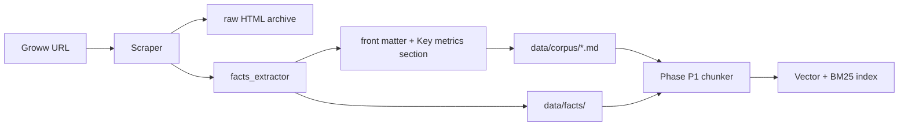

# Fund Facts Storage

How **NAV**, **Minimum SIP**, **Fund Size (AUM)**, **Expense ratio**, and **Rating** are captured, stored, and used in the RAG pipeline.

---

## 1. Why two storage layers?

| Layer | Path | Purpose |
|-------|------|---------|
| **Structured facts** | `data/facts/` | Exact values for FAQ answers, change detection, APIs, validation |
| **Corpus (Markdown)** | `data/corpus/` | Human-readable body + front matter for chunking / embedding |
| **Vector index** (later) | `data/index/chunks.jsonl` | Retrieval chunks derived from corpus, including a **Key fund metrics** section |

Structured JSON avoids losing numbers when HTML→Markdown extraction picks the wrong region (e.g. holdings tables only). The Markdown corpus still holds the same facts in a **## Key fund metrics** block so RAG retrieval can ground answers.

---

## 2. Structured store (`data/facts/`)

### 2.1 Aggregate file

`data/facts/scheme_facts.json` — all schemes in one file, updated each scrape run:

```json
{
  "version": 1,
  "scrape_run_id": "12345",
  "content_captured_at": "2026-05-19",
  "updated_at": "2026-05-19T09:15:00+05:30",
  "schemes": {
    "hdfc_large_cap_direct_growth": {
      "scheme_id": "hdfc_large_cap_direct_growth",
      "scheme_name": "HDFC Large Cap Fund Direct Growth",
      "source_url": "https://groww.in/mutual-funds/hdfc-large-cap-fund-direct-growth",
      "nav": {
        "display": "₹1,174.37",
        "amount_inr": 1174.37,
        "as_of_display": "18 May '26",
        "as_of_iso": "2026-05-18"
      },
      "minimum_sip": {
        "display": "₹100",
        "amount_inr": 100
      },
      "fund_size_aum": {
        "display": "₹38,121.27 Cr",
        "amount_cr": 38121.27
      },
      "expense_ratio": {
        "display": "0.99%",
        "percent": 0.99
      },
      "rating": {
        "display": "4",
        "value": 4
      },
      "facts_hash": "sha256-of-canonical-facts-json",
      "extraction_status": "complete"
    }
  }
}
```

### 2.2 Per-scheme file

`data/facts/by_scheme/{scheme_id}.json` — same object as one entry under `schemes`, for easy diff and tooling.

### 2.3 Field definitions

| Field | Groww label | Example | Notes |
|-------|-------------|---------|-------|
| `nav` | NAV + date line | ₹1,174.37 on 18 May '26 | `display` for answers; parsed `amount_inr` for validation |
| `minimum_sip` | Min. for SIP | ₹100 | Minimum SIP amount |
| `fund_size_aum` | Fund size (AUM) | ₹38,121.27 Cr | Stored as Cr where applicable |
| `expense_ratio` | Expense ratio | 0.99% | TER; `percent` numeric |
| `rating` | Rating | 4 | Groww star-style rating on page |

`extraction_status`: `complete` | `partial` | `failed` — if a field is missing, list it in `missing_fields[]`.

---

## 3. Corpus store (`data/corpus/*.md`)

### 3.1 YAML front matter (summary copy)

Key metrics are duplicated in front matter for quick access without parsing JSON:

```yaml
---
source_url: https://groww.in/mutual-funds/...
scheme_id: hdfc_large_cap_direct_growth
scheme_name: HDFC Large Cap Fund Direct Growth
nav_display: "₹1,174.37"
nav_as_of: "2026-05-18"
minimum_sip_display: "₹100"
fund_size_aum_display: "₹38,121.27 Cr"
expense_ratio_display: "0.99%"
rating_display: "4"
facts_hash: abc123...
---
```

### 3.2 Markdown body — Key fund metrics section

Inserted **at the top of the body** (before holdings / returns tables):

```markdown
## Key fund metrics

| Metric | Value |
|--------|-------|
| NAV (as of 18 May '26) | ₹1,174.37 |
| Minimum SIP | ₹100 |
| Fund size (AUM) | ₹38,121.27 Cr |
| Expense ratio | 0.99% |
| Rating | 4 |
```

This section is the primary source for the **dense fact chunk** at embedding time ([Chunking_Embedding_Architecture.md](./Chunking_Embedding_Architecture.md) §4.2).

---

## 4. Manifest linkage

`data/index/ingestion_manifest.json` records per scheme:

```json
{
  "schemes": {
    "hdfc_large_cap_direct_growth": {
      "content_hash": "...",
      "facts_hash": "...",
      "facts_status": "complete",
      "missing_fields": []
    }
  }
}
```

- **`content_hash`** — full Markdown body (detects any page change).
- **`facts_hash`** — canonical JSON of the five metrics only (detects KPI changes even if body layout shifts).

GitHub Actions sets `corpus_changed` when **either** hash changes.

---

## 5. Data flow



---

## 6. How RAG uses these fields

| User question | Retrieval |
|---------------|-----------|
| What is the expense ratio? | Chunk from **Key fund metrics** or structured filter on `expense_ratio.percent` |
| Minimum SIP? | Same — `minimum_sip` |
| Current NAV? | `nav.display` + `nav.as_of_display` in chunk / front matter |
| Fund size? | `fund_size_aum` |
| Rating? | `rating` |

Answers still cite the single Groww `source_url`. Footer date uses `content_captured_at`.

---

## 7. Implementation

| Module | Role |
|--------|------|
| `phases/p0_scrape/facts_extractor.py` | Parse HTML → `FundFacts` |
| `phases/p0_scrape/facts_store.py` | Write `data/facts/` + merge manifest |
| `phases/p0_scrape/writer.py` | Inject metrics table + front matter |

---

*Related: [RAG_Architecture.md](./RAG_Architecture.md) §4.2 · [Chunking_Embedding_Architecture.md](./Chunking_Embedding_Architecture.md)*
