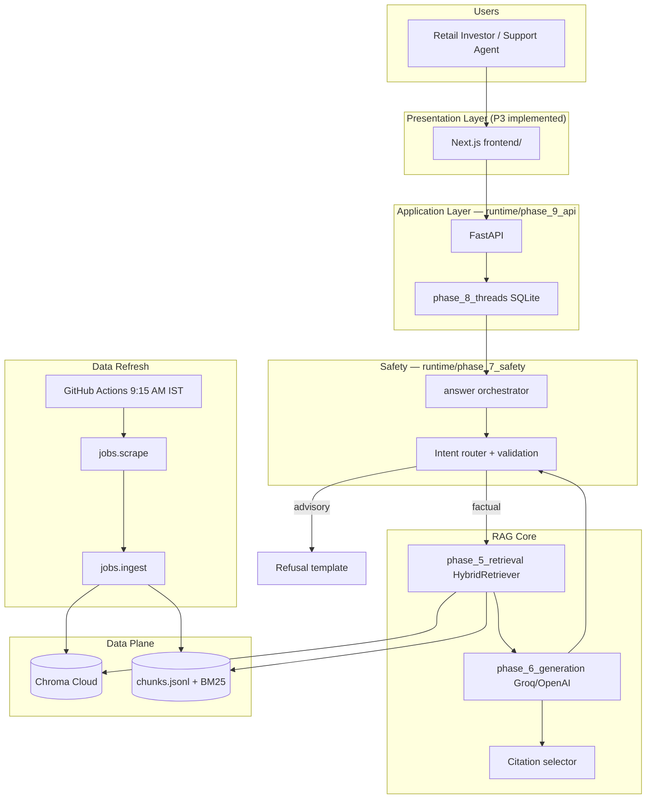
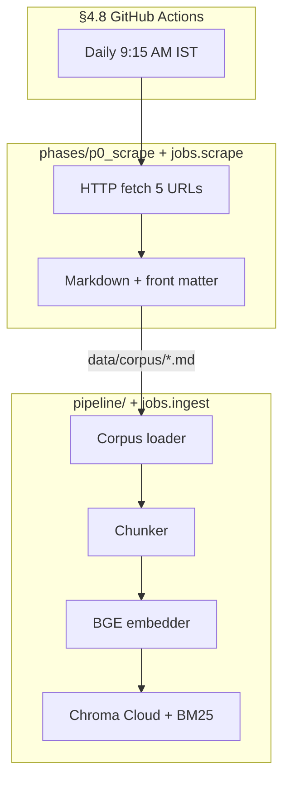
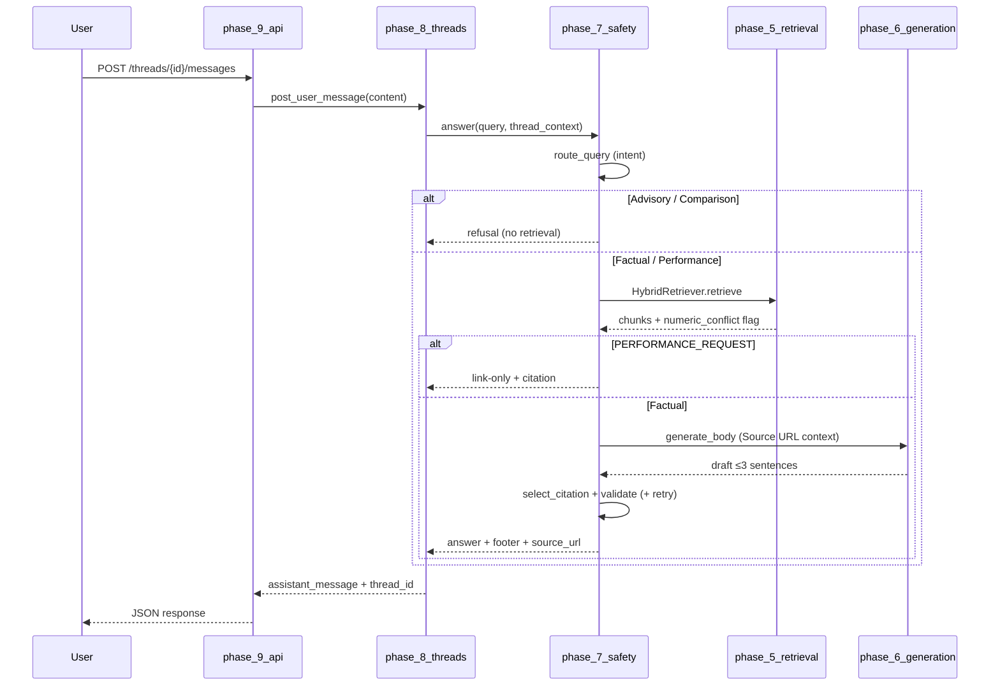
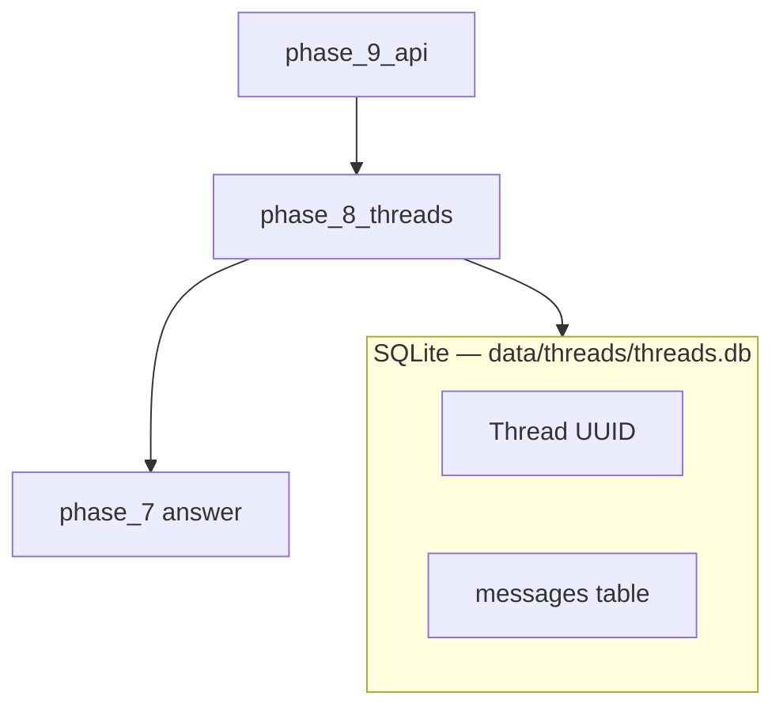
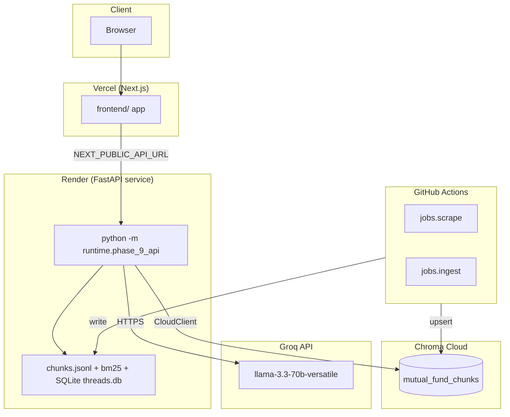

# RAG Architecture: Mutual Fund FAQ Assistant (Facts-Only)

## Document Purpose

This document defines the **Retrieval-Augmented Generation (RAG)** architecture for a **facts-only** mutual fund FAQ assistant, using **Groww** as the reference product context (per [ProblemStatement.md](./ProblemStatement.md)). It serves as the implementation blueprint for engineering, compliance review, and operations.

**Implementation status (May 2026):** Offline pipeline (P0/P0b), RAG runtime (P1), compliance (P2), API/threads (phases 5–9 under `runtime/`), and initial Next.js frontend (P3 under `frontend/`) are **implemented in code**. Golden eval / monitoring (P4) remain **planned**.

---

## 0. Current Project Scope (In Scope)

### 0.1 AMC and schemes

| # | Scheme | Category (diversity) | Canonical citation URL |
|---|--------|----------------------|-------------------------|
| 1 | HDFC Mid Cap Fund Direct Growth | Mid cap | https://groww.in/mutual-funds/hdfc-mid-cap-fund-direct-growth |
| 2 | HDFC Equity Fund Direct Growth | Equity (diversified) | https://groww.in/mutual-funds/hdfc-equity-fund-direct-growth |
| 3 | HDFC Focused Fund Direct Growth | Focused | https://groww.in/mutual-funds/hdfc-focused-fund-direct-growth |
| 4 | HDFC ELSS Tax Saver Fund Direct Plan Growth | ELSS | https://groww.in/mutual-funds/hdfc-elss-tax-saver-fund-direct-plan-growth |
| 5 | HDFC Large Cap Fund Direct Growth | Large cap | https://groww.in/mutual-funds/hdfc-large-cap-fund-direct-growth |

- **AMC**: HDFC Mutual Fund (single AMC for MVP).
- **Corpus size**: 5 scheme pages (~45–50 chunks after ingest; not the original 15–25 multi-document target).
- **No PDFs in v1**: Factsheets, KIM, SID, and other PDFs are **out of scope**. Page content is fetched from the five Groww URLs via the **scraping service** and stored as Markdown.
- **Daily refresh**: **GitHub Actions** runs every day at **9:15 AM IST** to scrape latest data and re-index (see §4.8).
- **Chunking & embedding**: Specified in [Chunking_Embedding_Architecture.md](./Chunking_Embedding_Architecture.md).

### 0.2 Corpus delivery model

```
data/corpus/
  hdfc-mid-cap-fund-direct-growth.md
  hdfc-equity-fund-direct-growth.md
  hdfc-focused-fund-direct-growth.md
  hdfc-elss-tax-saver-fund-direct-plan-growth.md
  hdfc-large-cap-fund-direct-growth.md
```

Each file MUST include at minimum:

```yaml
---
source_url: https://groww.in/mutual-funds/<scheme-slug>
scheme_name: "<Full scheme name>"
scheme_id: hdfc_mid_cap_direct_growth
amc_name: HDFC Mutual Fund
scheme_category: mid_cap | large_cap | elss | focused | equity
content_captured_at: "2026-05-18"
---
```

Markdown under `data/corpus/` is **written by the scraping service** (§4.2). Ingestion reads these files, writes `chunks.jsonl` and BM25 locally, and upserts dense vectors to **[Chroma Cloud](https://www.trychroma.com/)** — **not** a local `data/index/chroma/` folder.

### 0.3 Citation and allowlist rules (v1)

- Every factual answer cites **exactly one** of the five `source_url` values from chunk metadata (returned as `source_url` in the API; stripped from answer body text).
- **Domain allowlist for citations**: `groww.in` only (scheme pages in corpus).
- **Refusal / education links** (advisory queries): AMFI or SEBI URLs via `EDUCATIONAL_URL` / `config/compliance.yaml` — not part of the retrieval corpus.

### 0.4 Out of scope (v1)

| Item | Status |
|------|--------|
| PDF factsheets, KIM, SID | Not provided; not ingested |
| AMC / AMFI / SEBI document crawl | Not in retrieval corpus |
| Live Groww scraper | **Implemented** — `phases/p0_scrape/`, `python -m jobs.scrape` |
| Chunking / embedding | **Implemented** — `pipeline/`, `python -m jobs.ingest` |
| Next.js UI | **Implemented (v1)** — P3 (`frontend/`) with landing + analysis pages |
| Golden eval / production monitoring | **Planned** — P4 |
| 15–25 URL corpus | Deferred; 5 Groww scheme pages only |

---

## 1. Architecture Principles

| Principle | Implication for RAG |
|-----------|---------------------|
| **Facts-only** | Corpus limited to five curated Groww Markdown files; prompts, validation, and refusal classifiers block advice. |
| **Source-backed** | Citation URL selected from retrieved chunk metadata (`runtime/phase_5_retrieval/citation.py`), not invented by the LLM. |
| **Concise** | ≤3 sentences in answer body + mandatory footer line. |
| **Compliant** | No advice, comparisons, or return calculations; advisory queries blocked **before** retrieval. |
| **Freshness** | Daily scrape; `content_captured_at` on cited chunk drives footer. |
| **Transparent** | Footer: `Last updated from sources: <date>` (cited chunk only — see §3.3.3). |
| **Privacy-first** | Threads are isolated by `session_key` (frontend derives from signed-in email in MVP); thread IDs are opaque UUIDs; PII patterns redacted in output. |

---

## 2. High-Level System Context



---

## 3. Logical Layers & Code Map

### 3.1 Presentation Layer (P3 — implemented)

**Target**: Next.js app in `frontend/` with `NEXT_PUBLIC_API_URL` pointing at the FastAPI origin.

**Responsibilities**

- Two-page flow:
  - `/` landing page (hero, navigation, CTA).
  - `/analysis` chat workspace.
- Landing CTA (**Start Analysis**) opens a signup modal on first use.
- Signup modal fields: `name`, `gender`, `email`, `profession`.
- On signup submit, user profile is stored in browser `localStorage` and user is redirected to `/analysis`.
- Returning users on the same browser/device skip signup (profile reused) until they click switch/sign out.
- Multi-thread chat UI backed by §9 thread endpoints.
- Display answer text and source freshness footer in the assistant response.
- Analysis header shows avatar (derived from selected gender) and `Welcome, <username>` on the top-right.
- Sidebar conversation management:
  - **Pinned conversations** section above recent conversations.
  - Per-thread 3-dot menu with `Pin`, `Rename`, `Delete`, `Archive`.
  - Bottom-left **Settings** menu with `Archived chats`, `Question guide`, and `Sign out`.
- Composer includes a cloud quick-help control:
  - 4 suggested factual questions are available from a cloud icon.
  - Expanded cloud list includes a hint to open **Question guide** in Settings for more prompts.
  - Selecting a cloud question sends it in the current chat thread.
- Question Guide modal:
  - 20 curated factual prompts split into 4 sections (5 per section, paginated).
  - Selecting a guide prompt sends it in the current active thread.
- Frontend passes `session_key=<signed-in-email>` to thread list/create endpoints for per-user thread isolation.

**Status**: Implemented in `frontend/app/page.tsx` and `frontend/app/analysis/page.tsx`.

### 3.2 Application Layer — `runtime/phase_9_api`

| Endpoint | Purpose | Status |
|----------|---------|--------|
| `GET /` | Service pointers (docs, UI path, thread API) | Implemented |
| `GET /health` | Liveness + `corpus_version` | Implemented |
| `POST /threads` | Create thread (UUID), accepts optional `session_key` body field | Implemented |
| `GET /threads` | List threads, supports optional `session_key` query filter | Implemented |
| `PATCH /threads/{id}` | Rename/pin thread | Implemented |
| `DELETE /threads/{id}` | Delete thread + history | Implemented |
| `GET /threads/{id}/messages` | Message history | Implemented |
| `POST /threads/{id}/messages` | User message → RAG → assistant reply | Implemented |
| `POST /chat` | Legacy single-shot chat | Implemented (compat) |
| `POST /admin/reindex` | Protected stub (501) | Implemented |
| `POST /internal/scrape` | Admin scrape all | Implemented |
| `POST /internal/ingest` | Admin ingest | Implemented |

**Run**: `python -m runtime.phase_9_api` or `uvicorn api.main:app` (re-exports phase 9 app).

**Environment**: `PORT`, `API_HOST`, `RUNTIME_API_DEBUG`, `ADMIN_REINDEX_SECRET`, `API_CORS_ORIGINS` — see `.env.example`.

### 3.3 Multi-thread chat — `runtime/phase_8_threads`

| Feature | Implementation |
|---------|----------------|
| Storage | SQLite (`THREAD_DB_PATH`, default `data/threads/threads.db`) |
| Thread ID | Opaque UUID |
| Messages | `{ role, content, timestamp, retrieval_debug_id }` |
| Context window | Last `THREAD_MAX_TURNS` user lines (default 4) |
| Follow-up expansion | Template merge of prior user line + follow-up (`expand.py`) |
| Pipeline entry | `post_user_message()` → `runtime/phase_7_safety.answer()` |

**CLI**: `python -m runtime.phase_8_threads new-thread|say|history|context|list-threads`

### 3.4 Safety & orchestration — `runtime/phase_7_safety`

**Pre-retrieval router** (`router.py` + `phases/p2_compliance/intent_router.py`):

| Intent | Examples | Action |
|--------|----------|--------|
| `FACTUAL_LOOKUP` | Expense ratio, exit load, minimum SIP | Proceed to RAG |
| `PROCESS_HOWTO` | Download statements | Proceed to RAG |
| `PERFORMANCE_REQUEST` | Returns, CAGR | Link-only answer; no return synthesis |
| `ADVISORY` | *Should I invest?* | Refusal + education URL; **no retrieval** |
| `COMPARISON` | Compare Fund A vs B | Refusal; **no retrieval** |
| `OUT_OF_SCOPE` | Unknown scheme / other AMC | Refusal with scope guidance |

**Router stack**

1. Rule-based patterns (`config/compliance.yaml`)
2. BGE embedding similarity to refusal exemplars (`phases/p2_compliance/embedding_classifier.py`)
3. Personal-situation heuristic (e.g. *"I am 45…"*) → advisory refusal

**Post-generation validation** (`validation.py`):

- ≤3 sentences; forbidden phrase list; advisory/comparison language detection
- Citation domain + corpus URL allowlist
- PII redaction (`pii.py`)
- One strict regeneration retry via phase 6; templated safe fallback on persistent failure

**Orchestrator**: `answer()` — route → retrieve (phase 5) → generate (phase 6) → cite → validate → footer.

**CLI**: `python -m runtime.phase_7_safety "…"` | `--route-only "…"`

**Env**: `EDUCATIONAL_URL` overrides default AMFI education link.

### 3.5 Retrieval Layer — `runtime/phase_5_retrieval`

**Hybrid retrieval strategy (implemented)**

| Stage | Technique | Config / code |
|-------|-----------|---------------|
| 1 | Query preprocessing | TER→expense ratio; scheme resolution with confidence |
| 2 | Dense retrieval | BGE `BAAI/bge-small-en-v1.5` + Chroma Cloud cosine |
| 3 | Sparse retrieval | BM25 (`data/index/bm25/`) |
| 4 | Fusion | RRF (`dense_weight` 0.7 / `sparse_weight` 0.3) |
| 5 | Metadata filter | `scheme_id` when confidence ≥ `scheme_filter_min_confidence` (0.85); AMC hint when HDFC mentioned |
| 6 | Reranking | Lexical term overlap (+ optional cross-encoder; **off** by default) |
| 7 | Merge | Combine chunks sharing same `source_url` |
| 8 | Conflict detect | Labeled metric disagreement → conservative citation |

**Parameters** (`config/rag.yaml` → `retrieval:`):

| Key | Default |
|-----|---------|
| `dense_top_k` | 20 |
| `sparse_top_k` | 20 |
| `rerank_top_k` | 5 |
| `similarity_threshold` | 0.72 |
| `merge_by_source_url` | true |
| `use_cross_encoder` | false |

**Citation** (`citation.py`): primary rule = highest `retrieval_score`; tie-break on answer token overlap and newer `content_captured_at`; allowlist fallback on numeric conflict.

**CLI**: `python -m runtime.phase_5_retrieval "…" [--json]`

### 3.6 Generation Layer — `runtime/phase_6_generation`

**LLM**: Groq (`llama-3.3-70b-versatile`) via OpenAI-compatible API; OpenAI fallback if only `OPENAI_API_KEY` is set; extractive/structured fallback without any LLM key.

**Context packaging (§6.1 implemented)** — each chunk block:

```
[1] Source URL: https://groww.in/mutual-funds/...
Scheme: HDFC Large Cap Fund Direct Growth
Section: Fees and loads
Content captured: 2026-05-18
---
{chunk text}
```

**Rules enforced in system prompt**: facts-only, ≤3 plain sentences, no URLs/markdown/tables in body, no advice or return math.

**Retry**: one strict regeneration on table dump or LLM failure; structured fallback from metrics tables when LLM unavailable.

**Footer policy**: `generation.footer_policy: cited_source` — footer date is the **cited chunk’s** `content_captured_at` only (not max across all retrieved chunks).

**CLI**: `python -m runtime.phase_6_generation "…"`

### 3.7 Compliance module — `phases/p2_compliance`

Shared config and classifiers used by phase 7:

| Module | Role |
|--------|------|
| `intent_router.py` | Intent classification |
| `embedding_classifier.py` | BGE exemplar similarity |
| `scheme_scope.py` | In-scope scheme detection |
| `refusal.py` | Refusal / performance guard templates |
| `guardrails.py` | Legacy re-export path (validation lives in phase 7) |
| `config/compliance.yaml` | Patterns, exemplars, forbidden output phrases |

### 3.8 Thin compatibility layer — `pipeline/rag/`

Legacy import paths re-export runtime phases:

| File | Delegates to |
|------|--------------|
| `orchestrator.py` | `runtime.phase_7_safety.answer` |
| `retriever.py` | `runtime.phase_5_retrieval` |
| `generator.py` | `runtime.phase_6_generation` |
| `citation.py` | `runtime.phase_5_retrieval.citation` |

**CLI**: `python -m pipeline.rag "question"` (same as phase 7 answer without thread store).

---

## 4. Data Refresh, Scraping & Ingestion Pipeline



Details: [Chunking_Embedding_Architecture.md](./Chunking_Embedding_Architecture.md).

### 4.1 URL registry — `config/sources.yaml`

Canonical list of **5 Groww URLs**. Ingestion fails fast if `corpus_file` is missing or front-matter `source_url` does not match the registry.

### 4.2 Groww scraping service — `phases/p0_scrape/`

| Command | Purpose |
|---------|---------|
| `python -m jobs.scrape` | Scrape all schemes (CI + local) |
| `POST /internal/scrape` | API trigger (all) |
| `POST /internal/scrape/{scheme_id}` | API trigger (one scheme) |

Outputs: `data/corpus/*.md`, scrape manifest, optional raw HTML archive.

### 4.3 Corpus loading & validation — `pipeline/corpus_loader.py`

Validates front matter, allowlisted URLs, required metadata fields.

### 4.4 Normalization, chunking & embedding — `pipeline/`

| Stage | Module | Output |
|-------|--------|--------|
| Normalize | `normalize.py` | Clean body + `content_hash` |
| Chunk | `chunker.py` | `data/index/chunks.jsonl` |
| Embed | `embedder.py` + `vector_store.py` | Chroma Cloud collection `mutual_fund_chunks` |
| BM25 | `bm25_index.py` | `data/index/bm25/` |
| Orchestration | `ingest.py` | `ingestion_manifest.json`, `corpus_version` |

**CLI**: `python -m jobs.ingest [--force] [--force-reembed]`

**Vector store**: `chromadb.CloudClient` via `pipeline/chroma_client.py`; credentials `CHROMA_API_KEY`, `CHROMA_TENANT`, `CHROMA_DATABASE`, optional `CHROMA_HOST`.

### 4.7 Corpus versioning

| Artifact | Purpose |
|----------|---------|
| `corpus_version` | Monotonic ID per successful ingest |
| `content_hash` | Per-scheme change detection |
| `ingestion_manifest.json` | Audit trail |
| `embeddings_manifest.json` | Model, collection, vector store mode |

### 4.8 Scheduler — GitHub Actions

**Workflow**: `.github/workflows/daily-corpus-refresh.yml`

| Setting | Value |
|---------|--------|
| Cron (UTC) | `45 3 * * *` (= 09:15 IST) |
| Manual | `workflow_dispatch` with `force_scrape`, `force_reindex` |
| Concurrency | `daily-corpus-refresh`, `cancel-in-progress: false` |

**Jobs**

| Job | Command | Notes |
|-----|---------|-------|
| `scrape` | `python -m jobs.scrape` | Sets `corpus_changed` output |
| `chunk-and-embed` | `python -m jobs.ingest --force --force-reembed` on schedule | BGE local; Chroma Cloud upsert |
| `publish` | Artifact upload | `chunks.jsonl`, BM25, manifests |

**Scheduled ingest**: always runs after successful scrape. **Manual run**: ingest only if `corpus_changed` or `force_reindex`.

**Secrets**: `CHROMA_API_KEY`, `CHROMA_TENANT`, `CHROMA_DATABASE`, optional `CHROMA_HOST`.

**Local dev**: `python -m jobs.scrape` then `python -m jobs.ingest --force`.

---

## 5. End-to-End Query Flow



### 5.1 Query understanding (implemented)

1. **Scheme resolution** — dictionary match + aliases; confidence-gated `scheme_id` filter (`scheme_resolution.py`).
2. **Vocabulary expansion** — e.g. TER → expense ratio (`preprocess.py`).
3. **Thread context** — last N user lines; optional follow-up expansion (`phase_8_threads/expand.py`).

### 5.2 Supported factual query types

| Category | Example | Primary source |
|----------|---------|----------------|
| Fee & load | Expense ratio, exit load | Groww scheme page chunk |
| Investment limits | Minimum SIP/lump sum | Groww scheme page chunk |
| Tax & lock-in | ELSS lock-in | HDFC ELSS Groww page |
| Risk / benchmark / AUM | Riskometer, benchmark, fund size | Groww scheme page chunk |
| Process / off-page | Download statements | “Not in corpus” if absent from Markdown |

### 5.3 Performance-related queries

**Implemented behavior**: classify as `PERFORMANCE_REQUEST`; retrieve for citation only; respond with `performance_guard_message` + single Groww scheme URL; block unsanctioned return figures in validation. No LLM synthesis of returns.

---

## 6. Multi-Thread Conversation Architecture



| Policy | Value |
|--------|--------|
| Storage | SQLite (swap for Postgres in production if needed) |
| Thread ID | UUID; scoped by optional `session_key` filter at list/create time |
| Context | Last `THREAD_MAX_TURNS` user messages (default 4) |
| PII | Not stored in thread schema |
| Concurrency | Stateless API; shared DB file (single-node MVP) |

---

## 7. UI Integration Points (P3)

| UI element | Backend contract |
|------------|------------------|
| Landing CTA (`/`) | Signup modal + client route navigation to `/analysis` |
| Signup modal | Local browser profile storage (`name`, `gender`, `email`, `profession`) |
| Analysis chat header/body | `POST /threads/{id}/messages`, `GET /threads/{id}/messages` |
| Thread sidebar | `GET /threads?session_key=<email>`, `POST /threads` with `session_key` |
| Thread actions | `PATCH /threads/{id}` (pin/rename), `DELETE /threads/{id}` |
| Archive UI action | Client-side archive state (localStorage) + archived list view toggle |
| Sidebar settings | `Sign out` clears local profile; `Archived chats` toggles archived view; `Question guide` opens curated prompts modal |
| Composer cloud icon | 4 quick prompts + hint to Question Guide; sends prompt in active thread |
| Refusal bubble | `assistant_message.refused`, `education_url` |
| Dev setup | `frontend/` + `NEXT_PUBLIC_API_URL=http://127.0.0.1:8080` |

---

## 8. Security, Privacy & Compliance

### 8.1 Data handling

- **No collection** of PAN, Aadhaar, account numbers, OTP, email, or phone in thread schema.
- Output PII patterns redacted (`phase_7_safety/pii.py`).
- Debug fields (`chunk_ids`, latency) only when `RUNTIME_API_DEBUG=1`.
- UI-only signup profile (`name`, `gender`, `email`, `profession`) is stored in client `localStorage` for convenience UX (non-authenticated MVP). This data is browser-local and not shared across systems.
- Frontend uses signed-in email as `session_key` for `/threads` list/create so one browser user does not see another user's thread list.

### 8.2 Source integrity

- Citations restricted to five corpus URLs in `config/sources.yaml`.
- Citation validator checks domain and exact URL allowlist.

### 8.3 Defense in depth

1. Intent router (pre-retrieval) — phase 7 + P2
2. Prompt constraints — phase 6
3. Post-generation validation — phase 7
4. Citation allowlist — phase 5 + phase 7

---

## 9. Application & API Layer (Implemented)

### 9.1 Response payload — `POST /threads/{id}/messages`

```json
{
  "thread_id": "uuid",
  "assistant_message": {
    "content": "The minimum SIP is ₹500.\n\nLast updated from sources: 2026-05-18",
    "intent": "FACTUAL_LOOKUP",
    "source_url": "https://groww.in/mutual-funds/hdfc-large-cap-fund-direct-growth",
    "content_captured_at": "2026-05-18",
    "corpus_version": 8,
    "refused": false,
    "disclaimer": "Facts-only assistant..."
  },
  "debug": null
}
```

With `RUNTIME_API_DEBUG=1`, `debug` includes `latency_ms`, `chunk_ids`, `guardrail_flags`, `retrieval_debug_id`.

Production: leave `RUNTIME_API_DEBUG` unset.

### 9.2 Admin reindex

`POST /admin/reindex` with header `X-Admin-Secret: <ADMIN_REINDEX_SECRET>` returns **501 stub** (use `POST /internal/ingest` locally or GitHub Actions for real reindex).

---

## 10. Technology Stack (As Implemented)

| Component | Choice |
|-----------|--------|
| Language | Python 3.11+ |
| API | FastAPI + uvicorn (`runtime/phase_9_api`) |
| UI | Next.js in `frontend/` |
| Vector DB | **Chroma Cloud** (`mutual_fund_chunks`) |
| Sparse search | BM25 (`rank-bm25`, local) |
| Embeddings | **`BAAI/bge-small-en-v1.5`** via `sentence-transformers` (local) |
| LLM | **Groq** `llama-3.3-70b-versatile`; OpenAI optional fallback |
| Thread store | SQLite |
| Scheduler | GitHub Actions |
| Scraping | `phases/p0_scrape/` |
| Ingest | `pipeline/` + `jobs.ingest` |

**Not used**: LangChain/LlamaIndex orchestration, local Chroma persistence in production, Streamlit UI, in-memory-only threads.

---

## 11. Observability & Evaluation (P4 — planned)

| Metric | Target | Status |
|--------|--------|--------|
| Retrieval recall@5 | ≥ 90% | Not automated |
| Citation accuracy | 100% | Manual |
| Advisory refusal precision | ≥ 95% | Manual |
| Sentence count compliance | 100% | Enforced in phase 7 |

**Logging today**: `guardrail_flags`, optional debug payload, scrape/ingest manifests. Golden dataset and automated eval: `phases/p4_ops/` (placeholder).

---

## 12. Deployment Topology (Vercel + Render)



### 12.1 Target hosting

| Layer | Platform | Runtime |
|-------|----------|---------|
| Frontend | Vercel | Next.js app in `frontend/` |
| Backend | Render | FastAPI `python -m runtime.phase_9_api` |
| Vector DB | Chroma Cloud | Managed collection `mutual_fund_chunks` |
| LLM | Groq API | `llama-3.3-70b-versatile` |

### 12.2 Required environment variables

**Vercel (frontend):**

- `NEXT_PUBLIC_API_URL=https://<render-backend-domain>`

**Render (backend):**

- `PORT` (provided by Render)
- `API_HOST=0.0.0.0`
- `API_CORS_ORIGINS=https://<vercel-frontend-domain>`
- `CHROMA_API_KEY`, `CHROMA_TENANT`, `CHROMA_DATABASE` (and optional `CHROMA_HOST`)
- `GROQ_API_KEY` (and optional `GROQ_MODEL`)
- `THREAD_DB_PATH` (optional override; defaults to `data/threads/threads.db`)

### 12.3 Deployment notes

- Frontend calls backend only through `NEXT_PUBLIC_API_URL`; no direct browser calls to Chroma/Groq.
- Keep separate Chroma database/tenant for staging vs production.
- Render disk is ephemeral on many plans; if persistent chat history is required, use a persistent disk or migrate thread store from SQLite to Postgres.

---

## 13. Component Responsibilities & Code Paths

| Component | Code path | Status |
|-----------|-----------|--------|
| Scraper | `phases/p0_scrape/`, `jobs/scrape/` | Done |
| Scheduler | `.github/workflows/daily-corpus-refresh.yml` | Done |
| Ingest | `pipeline/`, `jobs/ingest/` | Done |
| Retrieval | `runtime/phase_5_retrieval/` | Done |
| Generation | `runtime/phase_6_generation/` | Done |
| Safety / orchestration | `runtime/phase_7_safety/` | Done |
| Threads | `runtime/phase_8_threads/` | Done |
| API | `runtime/phase_9_api/`, `api/main.py` | Done |
| Compliance rules | `phases/p2_compliance/`, `config/compliance.yaml` | Done |
| UI | `frontend/` | Done (landing + analysis) |
| Eval / ops | `phases/p4_ops/` | Not started |

---

## 14. Known Limitations & Mitigations

| Limitation | Mitigation |
|------------|------------|
| Stale Groww content | Daily scrape; footer shows `content_captured_at` |
| Groww HTML changes | Scraper fallbacks; keep last good index (`keep_last_good_index`) |
| Compare-table noise in chunks | Lexical rerank penalizes compare sections; conflict detection ignores compare blocks |
| Cross-encoder rerank | Optional (`use_cross_encoder: false`); lexical rerank default |
| Only 5 schemes | `OUT_OF_SCOPE` refusal + README scope list |
| No PDF / regulatory docs | Refuse facts not on Groww pages |
| LLM paraphrase drift | Low temperature; structured metrics fallback; validation retry |
| SQLite threads (single node) | Document Postgres migration for multi-instance prod |
| Admin reindex stub | Use `jobs.ingest` or GitHub Actions |

---

## 15. Implementation Phases

| Phase | Scope | Code | Status |
|-------|-------|------|--------|
| **P0** | Scrape, corpus, ingest, Chroma + BM25 | `phases/p0_scrape/`, `pipeline/`, `jobs/` | **Done** |
| **P0b** | GitHub Actions daily refresh | `.github/workflows/` | **Done** |
| **P1** | RAG runtime | `pipeline/rag/` → `runtime/phase_5–7` | **Done** |
| **P2** | Compliance / refusal | `phases/p2_compliance/` | **Done** |
| **P3** | Next.js UI | `frontend/`, `phases/p3_ui/` | **Done (initial)** |
| **P4** | Golden eval, monitoring | `phases/p4_ops/` | **Planned** |

**Runtime modules (query-time)**

| Module | CLI |
|--------|-----|
| `runtime/phase_5_retrieval` | `python -m runtime.phase_5_retrieval "…"` |
| `runtime/phase_6_generation` | `python -m runtime.phase_6_generation "…"` |
| `runtime/phase_7_safety` | `python -m runtime.phase_7_safety "…"` |
| `runtime/phase_8_threads` | `python -m runtime.phase_8_threads say …` |
| `runtime/phase_9_api` | `python -m runtime.phase_9_api` |

---

## 16. Configuration Reference

Configuration is split across files (not a single monolithic `rag.yaml` for schemes):

| File | Purpose |
|------|---------|
| `config/sources.yaml` | Five schemes, URLs, corpus paths |
| `config/scraper.yaml` | Fetch politeness, timeouts |
| `config/chunking.yaml` | Token limits, section rules |
| `config/embedding.yaml` | BGE model, Chroma collection, `chroma_mode: cloud` |
| `config/ingest.yaml` | Index paths, manifest locations |
| `config/rag.yaml` | Retrieval, generation, disclaimer |
| `config/compliance.yaml` | Intent patterns, exemplars, guardrails |

**Key environment variables** (see `.env.example`):

| Variable | Purpose |
|----------|---------|
| `CHROMA_API_KEY`, `CHROMA_TENANT`, `CHROMA_DATABASE` | Chroma Cloud |
| `GROQ_API_KEY`, `GROQ_MODEL` | LLM generation |
| `EDUCATIONAL_URL` | Refusal education link override |
| `THREAD_DB_PATH`, `THREAD_MAX_TURNS` | Thread store |
| `PORT`, `API_HOST` | API bind |
| `RUNTIME_API_DEBUG` | Dev-only debug on post-message |
| `ADMIN_REINDEX_SECRET` | Admin endpoint protection |
| `API_CORS_ORIGINS` | Next.js dev origin |
| `NEXT_PUBLIC_API_URL` | UI (`frontend/`) → API |

**`config/rag.yaml` (excerpt — as implemented)**

```yaml
retrieval:
  dense_top_k: 20
  sparse_top_k: 20
  rerank_top_k: 5
  similarity_threshold: 0.72
  scheme_filter_min_confidence: 0.85
  merge_by_source_url: true
  use_cross_encoder: false

generation:
  provider: groq
  model: llama-3.3-70b-versatile
  max_sentences: 3
  temperature: 0.1
  footer_policy: cited_source

guardrails:
  allowed_citation_domains:
    - groww.in
```

---

## 17. Summary

The Mutual Fund FAQ Assistant is a **compliance-first RAG stack** for **five HDFC schemes on Groww**:

1. **Offline**: `jobs.scrape` → `data/corpus/` → `jobs.ingest` → BGE embeddings in **Chroma Cloud** + local **BM25**, orchestrated daily at **9:15 AM IST** by GitHub Actions.
2. **Online**: FastAPI (`runtime/phase_9_api`) → SQLite threads (`phase_8`) → safety router (`phase_7`) → hybrid retrieval (`phase_5`) → constrained Groq generation (`phase_6`) → citation + validation → single Groww URL + footer.
3. **Compliance**: Advisory/comparison blocked before retrieval; performance queries are link-only; PII redacted; citations allowlisted.

Next steps: refine **P3** visual design and UX polish in `frontend/`; implement **P4** golden eval and production monitoring.

---

*Related: [ProblemStatement.md](./ProblemStatement.md) · [Chunking_Embedding_Architecture.md](./Chunking_Embedding_Architecture.md)*
